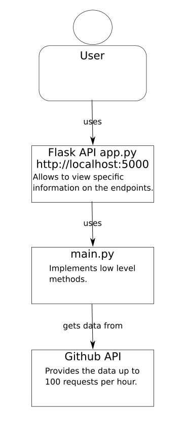

# Assignment

## Description

The aim of this assignment is to monitor activities happening on GitHub.
For that we want you to stream specific events from the Github API (
https://api.github.com/events). The events we are interested in are the
WatchEvent, PullRequestEvent and IssuesEvent.

Based on the collected events, metrics shall be provided at any time via a
REST API to the end user. The following metrics should be implemented:

 - Calculate the average time between pull requests for a given repository.

 - Return the total number of events grouped by the event type for a given
   offset. The offset determines how much time we want to look back i.e., an
   offset of 10 means we count only the events which have been created in the
   last 10 minutes.

Bonus assignment

 - Add another REST API endpoint providing a meaningful visualization of one of
   existing metrics or a newly introduced metric.

Please add a README file to your solution that contains how to run the solution
and a brief description about your assumptions. To get an idea of your
documentation skills, we ask you to create a simple diagram of your application
preferably regarding the C4 (level 1) model rules ( https://c4model.com/). The
assignment will have to be made in Python. We expect it will take 8 hours to do
it properly.

## Dependencies
```
python3
flask
matplotlib
```

## Running the repository

Assuming you have installed the dependencies correctly, clone and enter the repository

```
git clone https://github.com/tomichec/assignment
cd assignment
```

and run the flask module in it

```
export FLASK_APP=app
flask run
```

The following endpoint will be exposed on your http://localhost:5000

```
/avgTime/<username>/<reponame>
/groupEvents/<username>/<reponame>?offset=60
/showActors/<username>/<reponame>?offset=60
```
where the `<username>` is a username of a github user and `<reponame>` is a name of a repository owned by the user.

The github api is limited to 100 requests per hour without authentication.

For the clarity the C4 (level 1) is shown as follows:



